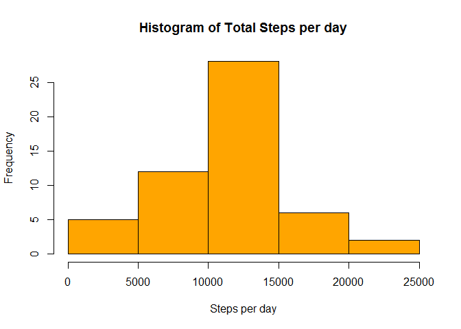

Loading and preprocessing the data
----------------------------------

    setwd("D:/Downloads/")
    unzip("repdata%2Fdata%2Factivity.zip")
    activitydata <- read.csv("activity.csv", sep = ",")

What is mean total number of steps taken per day?
-------------------------------------------------

    head(activitydata)

    ##   steps       date interval
    ## 1    NA 2012-10-01        0
    ## 2    NA 2012-10-01        5
    ## 3    NA 2012-10-01       10
    ## 4    NA 2012-10-01       15
    ## 5    NA 2012-10-01       20
    ## 6    NA 2012-10-01       25

    StepsTotal <- aggregate(steps ~ date, 
                            data = activitydata, 
                            sum, na.rm = TRUE)

    hist(StepsTotal$steps,
         col="orange",
         main="Histogram of Total Steps per day",
         xlab="Steps per day",
         ylab = "Frequency",
         cex.axis=1,cex.lab = 1)

 

    StepsMean <- mean(StepsTotal$steps)
    StepsMedian <- median(StepsTotal$steps)

What is the average daily activity pattern?
-------------------------------------------

    StepsInterval <- aggregate(steps ~ interval, 
                                data = activitydata, 
                                mean, na.rm = TRUE)

    plot(steps ~ interval, 
         data = StepsInterval, 
         type = "l", 
         xlab = "Interval",
         ylab = "Average number of steps", 
         main = "Average Daily Activity Pattern", 
         col = "orange")

    maxStepsInterval <- StepsInterval[which.max(StepsInterval$steps),"interval"]

Imputing missing values
-----------------------

    missing <- sum(is.na(activitydata$steps))

    activitydataNew <- activitydata

    StepsAverage <- aggregate(steps ~ interval, 
                              data = activitydataNew, 
                              mean)

    fillNA <- numeric()
    for (i in 1:nrow(activitydataNew)) {
            obs <- activitydataNew[i, ]
            
            if (is.na(obs$steps)) {
                    steps <- subset(StepsAverage, interval == obs$interval)$steps
            } else {
                    steps <- obs$steps
            }
            fillNA <- c(fillNA, steps)
            
    }

    activitydataNew$steps<- fillNA

    StepsTotalNew <- aggregate(steps ~ date, 
                                 data = activitydataNew, 
                                 sum, 
                                 na.rm = TRUE)
    hist(StepsTotalNew$steps, col = "blue", 
         xlab = "Number of Steps", 
         ylab = "Frequency",
         main = "Histogram of Total Steps per day")

    StepsMeanNew <- mean(StepsTotalNew$steps)
    StepsMedianNew <- median(StepsTotalNew$steps)

Are there differences in activity patterns between weekdays and weekends?
-------------------------------------------------------------------------

    activitydataNew$day <- ifelse(as.POSIXlt(as.Date(activitydataNew$date))$wday%%6 == 
                                            0, "weekend", "weekday")
    activitydataNew$day <- factor(activitydataNew$day, levels = c("weekday", "weekend"))

    activitydataNew2<- aggregate(steps ~ interval + day, 
                              data = activitydataNew,
                              mean)

    library(lattice)
    xyplot(steps ~ interval | factor(day), data = activitydataNew2,
           main="Average Steps (Weekend V.S. Weekday)",
           xlab="Interval", 
           ylab="Number of Steps",
           aspect = 1/2, 
           type = "l")

